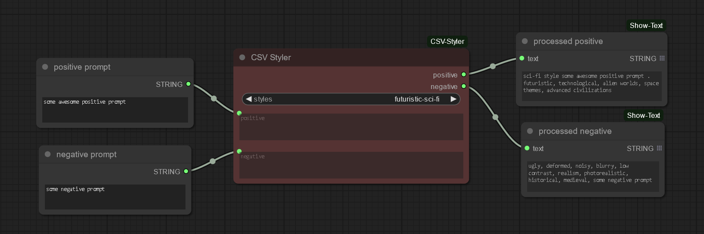

# CSV Styler

Repository contains CSV Styler - custom node for ComfyUI. It loads styles from styles.csv file (Automatic1111 Web-Ui styles.csv format) and combine them with provided positive and negative prompt.

styles.csv should be placed in ComfyUI root directory (near main.py).

## Usage example

Style phrase combined with provided positive and negative prompts. {prompt} keyworld is also taken into account.

## Installation

### Simple option

~~You can install CSV Styler using the ComfyUI Manager.~~ in progress...

### Manual option

Run within (ComfyUI)/custom_nodes/ folder:

~~~
git clone https://github.com/Pun0110/ComfyUI-CSV-Styler.git
~~~

## debug

...

## Known issues

...