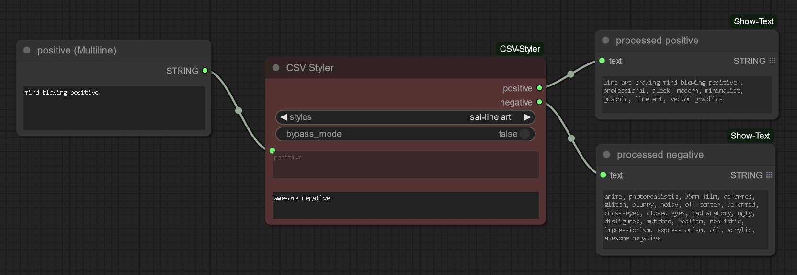
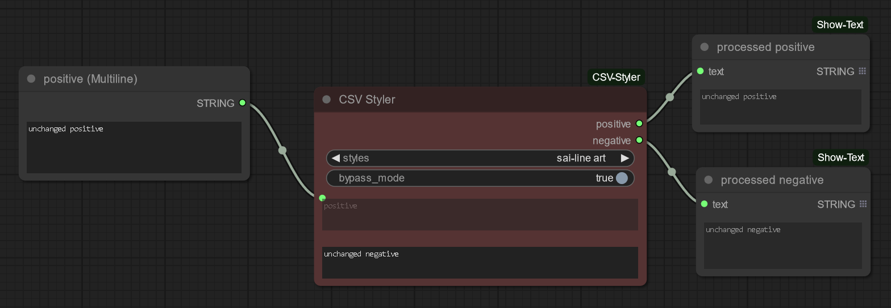

# CSV Styler

Repository contains CSV Styler - custom node for ComfyUI. The provided positive and negative prompts are processed according to selected style (styles parsed from `styles.csv` - Automatic1111 Web-Ui like format).

`styles.csv` should be placed in ComfyUI root directory (near `main.py`).

## Usage example

Provide positive and negative prompts in your preffered way and select necessary style. `{prompt}` keyworld in style is also taken into account.

Also style processing can be turned off (bypass mode). Input passed unchanged.

## Installation

### ComfyUI Manager

CSV Styler can be installed using the ComfyUI Manager. Search for `ComfyUI-CSV-Styler`.

### Manual option

Repo cloning. Execute command in (ComfyUI)/`custom_nodes` folder:

~~~
git clone https://github.com/Pun0110/ComfyUI-CSV-Styler.git
~~~

## Debug

The script outputs some diagnostic information to the console.
